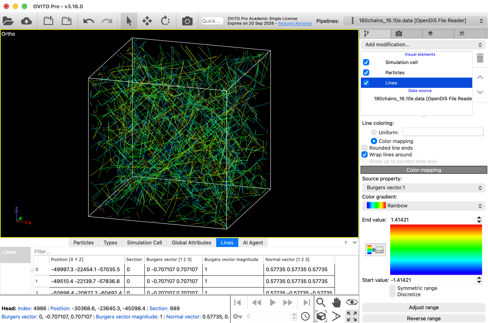

# OpenDiS File Reader
File reader for the file format used in the [OpenDiS](https://github.com/OpenDiS/OpenDiS) simulation framework for discrete dislocation dynamics (DDD). 

An example for this type of data file can be found [here](https://github.com/OpenDiS/OpenDiS/blob/main/examples/10_strain_hardening/180chains_16.10e.data).



## Description
This file reader imports the "nodes" in the OpenDIS file as particles and the "dislocation segments" or "arms" as [lines](https://docs.ovito.org/reference/pipelines/data_objects/lines.html) into OVITO. 

For more information and an example see this [discussion](https://github.com/OpenDiS/OpenDiS/issues/3).

## Installation
- This file reader is included in the [OVITO Extension Directory](https://www.ovito.org/extensions/) and can be [installed via the OVITO Pro GUI](https://docs.ovito.org/advanced_topics/python_extensions.html#topics-python-extensions-gallery).

- Alternatively, you can use the command line to install it in OVITO Pro [integrated Python interpreter](https://docs.ovito.org/python/introduction/installation.html#ovito-pro-integrated-interpreter):
  ```
  ovitos -m pip install --user git+https://github.com/ovito-org/OpenDiSFileReader.git
  ``` 
  The `--user` option is recommended and [installs the package in the user's site directory](https://pip.pypa.io/en/stable/user_guide/#user-installs).

- Other Python interpreters or Conda environments - if you want to use the file reader with the OVITO Python module:
  ```
  pip install git+https://github.com/ovito-org/OpenDiSFileReader.git
  ```

## Technical information / dependencies
- Tested on OVITO version 3.10.6

## Contact
For questions or support regarding this file reader, please contact:

Daniel Utt (utt@ovito.org)
